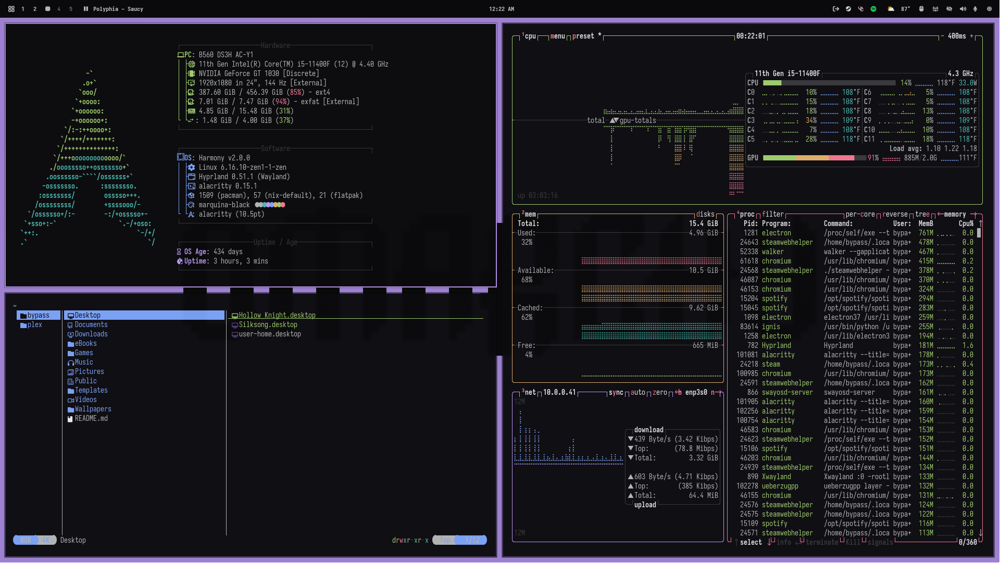

# Pandora

Named after the Pandora's Box in-game cosmetic for Counter-Strike: Global Offensive, Pandora is a striking dark theme with vibrant colors that are still easy on the eyes.


**The theme currently does not have a Neovim theme. If anyone has any recommendations, please share!**

## Screenshot

<p align="center">
  
</p>

## Installation

### Omarchy

To install this theme, simply use the `omarchy-theme-install` command:

```bash
omarchy-theme-install https://github.com/imbypass/omarchy-pandora-theme
```

## X.com
[imbypass](https://x.com/imbypass)
